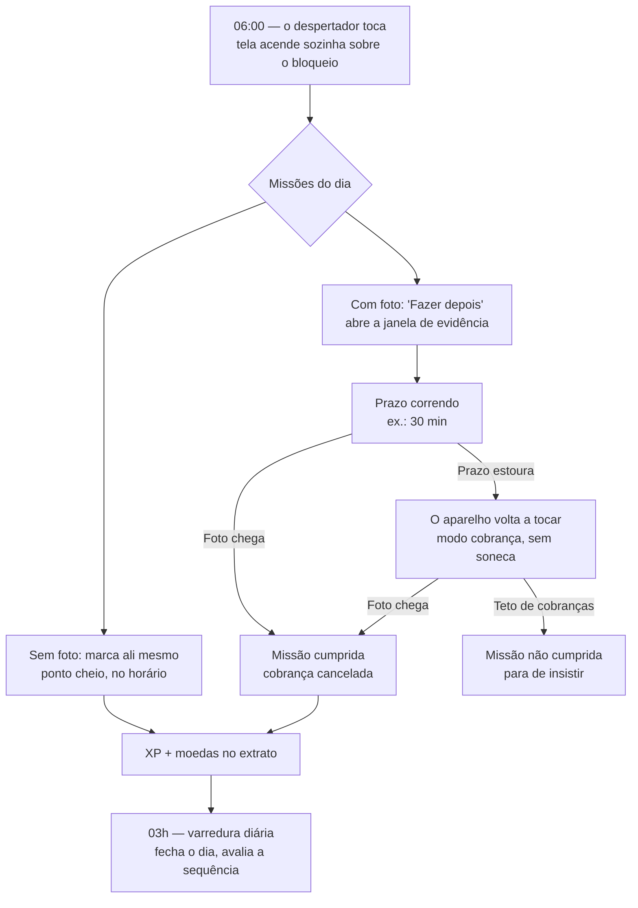
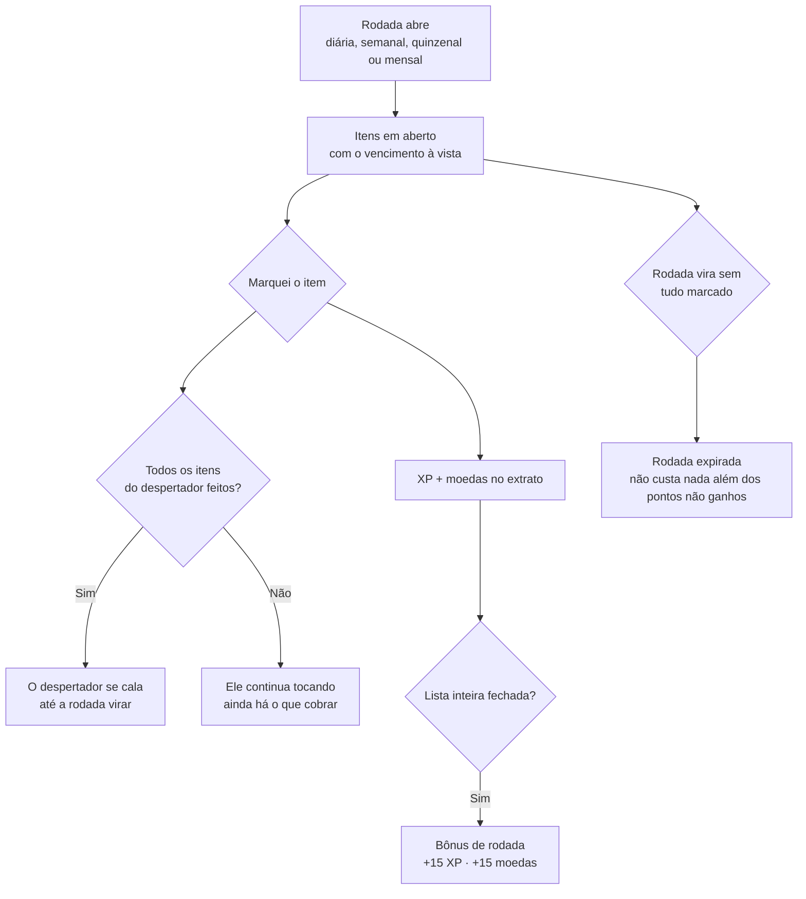

# Alvorada

Um despertador para Android que não aceita ser desligado. Ele acorda você, mostra o que
você prometeu fazer ao acordar e continua cobrando até você **provar com uma foto** que
fez. Cumprir vira XP e moedas; moedas viram prêmios que você mesmo cadastrou.

App pessoal, sem loja e sem servidor: tudo mora no aparelho, distribuído por APK direto.

---

## Índice

- [Por que ele existe](#por-que-ele-existe)
- [Um dia usando o app](#um-dia-usando-o-app)
- [Onde fica cada coisa](#onde-fica-cada-coisa)
- [Instalação e primeiro uso](#instalação-e-primeiro-uso)
- [Configurando o seu dia](#configurando-o-seu-dia)
- [Dois tipos de despertador](#dois-tipos-de-despertador)
- [Desligar: totalmente ou só a próxima](#desligar-totalmente-ou-só-a-próxima)
- [Repetição: quatro modos](#repetição-quatro-modos)
- [Checklists](#checklists)
- [Biblioteca de áudio](#biblioteca-de-áudio)
- [Pontos, níveis e sequência](#pontos-níveis-e-sequência)
- [Backup](#backup)
- [Decisões de design](#decisões-de-design)
- [Arquitetura](#arquitetura)
- [Como testar](#como-testar)
- [Quando o alarme não toca](#quando-o-alarme-não-toca)
- [Desenvolvimento](#desenvolvimento)
- [Limitações e próximos passos](#limitações-e-próximos-passos)

---

## Por que ele existe

Todo despertador tem o mesmo defeito: o botão de desligar encerra a transação. Você
acorda, desliga e volta a dormir — ou levanta e não faz nada do que tinha planejado. O
alarme cumpriu o contrato dele, e o seu dia não começou.

O Alvorada troca o contrato. Desligar o despertador não termina nada: **abre uma dívida**.
Cada missão que exige evidência ganha um prazo, e se a foto não chegar dentro dele o
aparelho volta a tocar. Fotografar a cama arrumada é trabalhoso de falsificar às 6h da
manhã — e é justamente esse atrito que faz a diferença entre "desliguei o alarme" e
"comecei o dia".

O resto do app existe para essa mecânica não virar uma fonte de culpa. Por isso XP nunca
decresce, por isso a sequência aceita 70% do dia em vez de exigir perfeição, por isso a
cobrança tem um teto e para de insistir. Um app que pune demais é desinstalado na terceira
semana ruim, e um despertador desinstalado acorda ninguém.

## Um dia usando o app



Em palavras, o mesmo caminho:

1. **O despertador toca.** A tela acende sozinha por cima do bloqueio, com o som no canal
   de alarme — passa por cima do silencioso e do Não Perturbe.
2. **As missões do dia aparecem na própria tela do alarme.** As que não exigem foto você
   marca ali, e elas valem ponto cheio: foram feitas no horário, que é o comportamento que
   o app quer reforçar.
3. **Ao dispensar, as missões com foto viram dívida** com prazo — a janela de evidência,
   configurável por missão (padrão de 30 minutos).
4. **Se a foto não chegar no prazo, o aparelho toca de novo**, em modo cobrança. Cobrança
   não tem soneca: adiar é exatamente o problema que ela existe para resolver.
5. **A cobrança se repete no intervalo configurado** até o teto da missão (padrão: 3). Aí
   ela vira "não cumprida" e o app se cala. Insistir para sempre viraria ansiedade.
6. **Cada missão cumprida credita XP e moedas** num extrato append-only. No prazo, valor
   cheio; depois do prazo, XP cheio e 60% das moedas.
7. **Por volta das 03h a varredura fecha o dia anterior**, avalia a sequência e reafirma
   todos os agendamentos.

## Onde fica cada coisa

Seis telas, todas no **menu lateral** — o botão de três linhas no canto de qualquer tela,
ou um arrasto da borda esquerda:

| Tela           | O que faz                                                                                             |
| -------------- | ----------------------------------------------------------------------------------------------------- |
| **Painel**     | A home. Fração de missões do dia, nível, moedas, sequência, faixa dos últimos 7 dias e o que falta.   |
| **Relógio**    | Seus despertadores, agrupados por categoria. É onde se cria e edita alarme e missão.                  |
| **Checklists** | Listas recorrentes com vencimento. Marcar um item cala o despertador dele até a próxima rodada.       |
| **Evidências** | A dívida fotográfica: o que falta com o prazo correndo, e o que já foi entregue hoje com miniaturas.  |
| **Galeria**    | Todas as fotos, agrupadas por dia, categoria ou despertador.                                          |
| **Prêmios**    | A loja. Recompensas que você cadastra com um preço em moedas, e o histórico de resgates.              |
| **Áudios**     | A biblioteca de sons. Baixa de um link, recorta o trecho, e alimenta o seletor do despertador.        |
| **Ajustes**    | Permissões, tema, backup e o teste de fogo do despertador.                                            |

As **quatro primeiras** também ficam na barra de baixo, porque são o ciclo diário e às 6h da
manhã o que se usa todo dia tem que estar a um toque, não a dois: o despertador cria a
dívida, Checklists e Evidências a liquidam, o Painel mostra o placar. Galeria, Prêmios e
Ajustes se abrem em dias raros e vivem só no menu.

Até a V1 eram cinco abas numa barra, e Ajustes era uma chave escondida no cabeçalho do
Painel. Cinco era o teto do que cabe numa barra sem virar sopa de ícone, e a V2 acrescenta
telas — então a lista completa foi para o menu lateral, e Ajustes virou um item nomeado
como os outros em vez de um botão que só encontra quem já sabe que ele existe.

Galeria, Prêmios, Áudios e Ajustes vivem só no menu.

O menu **não abre** por arrasto durante uma edição de despertador nem sobre o visor da
câmera: nas duas o gesto de borda pertence à tela, e abrir o menu ali significaria perder o
que estava sendo preenchido.

## Instalação e primeiro uso

Pelo Android Studio, com o celular ligado por USB e **Depuração USB** ativa, basta `Run`.
Por linha de comando, veja [Desenvolvimento](#desenvolvimento).

Na primeira abertura o app mostra uma tela de boas-vindas com um único pedido: **passar
pelos Ajustes antes de confiar nele**. Vale a pena obedecer. O despertador depende de
cinco permissões que o Android nega por padrão, e todas falham em silêncio — nada avisa
que o alarme não vai tocar, você descobre na manhã em que ele não toca.

Cada item da tela de Ajustes explica o que quebra sem ele e traz um botão que leva direto
à tela certa do sistema:

| Item                         | O que acontece sem ele                                                          |
| ---------------------------- | -------------------------------------------------------------------------------- |
| **Alarme exato**             | O sistema atrasa o disparo em minutos para poupar bateria. 7h00 deixa de ser 7h00. |
| **Notificações**             | O alarme toca dentro de um serviço em foreground, que exige notificação. Bloqueadas, ele nem começa. |
| **Canal "Despertadores"**    | Silenciado, a tela do alarme deixa de abrir sozinha mesmo com as notificações liberadas. |
| **Tela cheia sobre o bloqueio** | O alarme vira um aviso discreto no topo em vez de tomar a tela.                |
| **Otimização de bateria**    | O sistema mata o app entre um alarme e outro. É a causa número um de despertador que não toca. |

Se o seu aparelho for Xiaomi, Samsung, Huawei, Oppo, Motorola ou Vivo, aparece também um
aviso do fabricante: essas marcas mantêm um matador de processos próprio, acima das
configurações padrão do Android, e o Android não expõe essas telas por intent — é preciso
ir a pé nas configurações do sistema. O [dontkillmyapp.com](https://dontkillmyapp.com) tem
o passo a passo por modelo.

Enquanto algum item estiver pendente, um aviso fica fixo no topo do Painel. Ele não é
dispensável de propósito, e some sozinho quando tudo passa — inclusive se o sistema
revogar uma permissão meses depois, que é o caso que ninguém procura.

Por último, o **teste de fogo**, ainda em Ajustes: agende um alarme para daqui a 1 minuto,
bloqueie a tela e guarde o celular. Se não tocar ali, não vai tocar às 6h.

## Configurando o seu dia

A ordem que funciona:

1. **Crie uma categoria** (pasta) no Relógio — "Manhã", "Academia", "Estudo". Cada uma tem
   cor própria, e é por ela que o Painel agrupa o progresso do dia.
2. **Crie um despertador** dentro dela: horário, dias, som, volume, soneca e teto de
   sonecas. O som pode ser um do sistema ou um arquivo seu — arquivos escolhidos são
   **copiados** para dentro do app, então apagar o original depois não emudece o alarme.
3. **Adicione missões ao despertador.** Cada missão tem título, dias e **quanto vale** —
   veja abaixo. Por padrão ela **segue os dias do despertador**; desmarque a caixa para
   dar dias próprios a ela, sempre um subconjunto dos dias do alarme. Se ela **exigir
   evidência**, configure também a janela do prazo, o intervalo entre cobranças e o teto
   de cobranças.
4. **Cadastre prêmios** na aba Prêmios, com o preço em moedas. Sem isso as moedas não
   servem para nada — e a mecânica inteira depende delas servirem.

Uma missão nunca pode existir num dia em que o despertador dela não toca: ela ficaria
eternamente pendente, sem nada capaz de cumpri-la. A regra é aplicada na gravação, não só
na interface — encolher os dias de um alarme poda as missões que ficaram órfãs.

**Seguir os dias do despertador** é o padrão porque o contrário falha em silêncio: mudar o
alarme de Seg–Sex para todo dia e descobrir semanas depois que as missões continuaram
presas nos dias antigos significa um despertador que toca sem cobrar nada. Seguindo, elas
acompanham a mudança nos dois sentidos — ganham os dias novos e perdem os que sumiram.
Quem tem dias próprios só perde os que sumiram; os dias novos continuam sendo escolha sua.

### Quanto cada missão vale

Toda missão tem seu próprio XP e suas próprias moedas, escolhidos no editor numa escala de
**5, 10, 20 ou 40**. O padrão é 10 e 10 nos dois: quem não quiser diferenciar nada não
precisa tocar em nada, e as missões já criadas continuam valendo o que valiam.

Mexer aqui é o que deixa "arrumar a cama" valer menos que "ir à academia". Os dois valores
são independentes de propósito, porque fazem coisas diferentes:

- **XP** é progresso de nível e nunca é perdido — nem no atraso, nem na falha, nem ao
  gastar moedas. Subir o XP de uma missão diz "isto é o que me faz avançar".
- **Moedas** são saldo gastável em prêmios, e são o que o atraso e a soneca cobram. Subir
  as moedas diz "isto merece uma recompensa maior".

A escala é curta em vez de um campo numérico livre por um motivo prático: com campo livre a
tentação é subir todo mundo, e quando tudo vale muito nada vale mais do que nada. Na lista
de missões, o valor só aparece quando foge do padrão — repetir "10 XP · 10 moedas" em toda
linha esconderia justamente as que você diferenciou.

Um detalhe que ninguém percebe até acontecer: **a sequência conta missões, não pontos.** O
limiar de 70% do dia é sobre quantidade cumprida, então uma missão de 40 XP e uma de 5
pesam igual para a sequência. Elas se diferenciam no nível e no saldo, não no que quebra ou
mantém a sua sequência.

## Dois tipos de despertador

O "+" do Relógio pergunta qual dos dois você quer:

| Tipo                 | Repete            | Missões | Some sozinho |
| -------------------- | ----------------- | ------- | ------------ |
| **Padrão**           | nos dias que você escolher | sim | não     |
| **Autodestruível**   | uma vez, na data marcada   | não | sim      |

O autodestruível é para o compromisso avulso: a consulta de quinta às 14h, o bolo que sai
do forno em 40 minutos. Você escolhe só a data — "Hoje" e "Amanhã" ficam à mão, e o
calendário completo a um toque. Depois que ele toca e você desliga, ele **se apaga**:
some da lista, do banco e do `AlarmManager`.

Por que apagar em vez de só desativar? Porque um alarme de uma vez só que ficasse na lista
viraria entulho, e uma lista de despertadores cheia de entulho deixa de ser confiável —
você para de saber, batendo o olho, o que vai tocar amanhã.

Ele **não aceita missões**, e isso não é uma limitação a contornar: a missão nasceria numa
cobrança que ninguém poderia liquidar depois, porque o dono dela deixaria de existir no
primeiro toque. O editor explica isso no lugar da lista de missões, em vez de esconder o
botão sem dizer por quê.

A autodestruição acontece ao desligar e também quando o alarme se cala sozinho depois de
cinco minutos sem ninguém atender — os dois jeitos de um toque acabar sem deixar outro
marcado. Adiar não conta: a soneca tem um disparo a caminho. E, como o aparelho pode estar
desligado na hora marcada, a varredura diária e o reagendamento em massa também recolhem os
autodestruíveis cuja data já passou, poupando os que estão em soneca.

## Desligar: totalmente ou só a próxima

A chave de um despertador respondia a uma pergunta só — "vale ou não vale?" — e era usada
para duas coisas bem diferentes: a folga de amanhã e o despertador que não serve mais. Quem
a usava para a folga precisava lembrar de religar, e descobria que esqueceu na manhã
seguinte, dormindo demais.

Agora desligar abre duas opções:

- **Desligar próxima ativação** — pula só o próximo toque, com uma linha em verde dizendo
  exatamente quando ele volta. Nada mais muda: o despertador continua ligado.
- **Desligar totalmente** — o comportamento antigo. Fica desligado até você ligar de novo.

Enquanto o pulo está em vigor, a linha do despertador mostra qual toque foi dispensado e
desfaz o pulo com um toque. Ela precisa existir: sem ela a chave ficaria ligada e o alarme
não tocaria amanhã, que é a falha mais assustadora que um app de despertador pode ter.

O que fica gravado é o **instante** pulado, não um "pular: sim"
([`skipNextFireAt`](app/src/main/java/dev/gianluca/alvoradaapp/data/Entities.kt)), e ele só
vale enquanto continuar batendo com o toque que aconteceria de fato. É isso que faz o pulo
caducar sozinho em todos os caminhos que importam — o horário passou, o despertador foi
reconfigurado, a recorrência mudou — sem nenhuma rotina de limpeza para alguém esquecer de
chamar. Pela mesma razão, só dá para pular um toque de cada vez: guardar um segundo
instante devolveria o primeiro à agenda em silêncio.

Um despertador autodestruível não oferece essa escolha. Pular a única ativação que ele tem
seria a mesma coisa que apagá-lo, e para isso já existe o botão de excluir.

## Repetição: quatro modos

O bitmask de sete dias resolve a maioria dos casos, mas não cabe "última sexta do mês" nem
"dia 15 e 30". Em vez de inventar um campo por formato, o tipo de repetição é explícito
([Recurrence.kt](app/src/main/java/dev/gianluca/alvoradaapp/core/Recurrence.kt)) e cada
modo usa só os campos que lhe interessam:

| Modo                 | O que resolve                                                      |
| -------------------- | ------------------------------------------------------------------ |
| **Semanal**          | O padrão. Dias fixos, toda semana.                                 |
| **A cada N semanas** | Quinzenal e afins, com uma âncora que define a fase.               |
| **Semana do mês**    | 1ª a 5ª ocorrência, mais "última" — que **não** é o mesmo que "5ª". |
| **Dias do mês**      | Dia 15 e 30, ou o último dia do mês.                               |

No modo "dias do mês" o dia da semana é imprevisível, então as missões passam a valer
sempre que o despertador toca: restringi-las por dia da semana faria com que sumissem nos
meses em que o dia 15 cai numa terça.

Há um quinto valor no enum — o `ONCE` do autodestruível — que não aparece entre os chips.
Ele não é um modo de repetição, é a ausência de uma, e oferecer a conversão proporia algo
que o resto do app não sustenta: um despertador com missões viraria um sem elas.

O editor mostra uma prévia de **próximo disparo**. Ela existe para este bloco inteiro:
recorrência de calendário é fácil de configurar errado e impossível de conferir de cabeça.
Confira a data ali, em vez de descobrir daqui a três semanas que não tocou.

## Checklists

Boa parte dos despertadores é, na prática, uma lista que se repete: escovar os dentes todo
dia, limpar a mesa toda semana, limpar o teclado todo mês. A V1 só sabia modelar isso como
missão pendurada num despertador — o que forçava um despertador por item e não tinha noção
de ciclo nem de vencimento.

Um **checklist** é uma lista com frequência própria, um horário de vencimento e uma
categoria. Cada **item** pode ter um despertador vinculado, ou nenhum.



### Frequência

Os mesmos quatro modos do despertador, reusados sem uma linha de adaptação — porque são
exatamente o que um checklist precisa:

| O que você quer      | Como configurar                              |
| -------------------- | -------------------------------------------- |
| **Diário**           | Semanal, com todos os dias marcados           |
| **Semanal**          | Semanal, com um dia marcado                   |
| **Quinzenal**        | A cada 2 semanas, com uma âncora              |
| **Mensal**           | Dias do mês (dia 15) ou semana do mês (1ª segunda) |

**A rodada vale até a seguinte começar, não até vencer.** Um checklist diário que vence às
22h continua sendo o de hoje até a meia-noite: depois das 22h ele aparece como vencido, mas
ainda dá para marcar. Calar o despertador só até as 22h o faria tocar de novo à noite por
algo que já foi feito.

### Marcar cala o despertador

Marcar um item cala o despertador dele **até a próxima rodada** — e desmarcar o destrava.

A regra exata é: o despertador se cala quando **todos** os itens que apontam para ele
estiverem marcados. Se ele serve a dois itens e só um foi feito, ele ainda tem o que
cobrar. Quando um despertador recebe itens de checklists de tamanhos diferentes, o silêncio
vale até a **primeira** rodada virar.

O que fica gravado é o instante em que o silêncio expira
([`suppressedUntil`](app/src/main/java/dev/gianluca/alvoradaapp/data/Entities.kt)), e não um
sinalizador — o mesmo princípio de `skipNextFireAt`, pelo mesmo motivo: o valor caduca
sozinho quando a rodada vira, sem nenhuma rotina de limpeza para alguém esquecer de chamar.

São campos separados porque respondem a coisas diferentes. `skipNextFireAt` é um gesto
manual sobre **um** toque; `suppressedUntil` é consequência de um item marcado e precisa
cobrir **vários** — um checklist semanal num despertador diário tem sete para calar, e um
instante só não daria conta.

A lista de despertadores mostra os dois estados, e por obrigação: a regra da V1 é que não
existe despertador que não toca sem explicação. A diferença é que o silêncio por checklist
não oferece "desfazer" — quem calou foi o item, e o caminho de destravar é desmarcá-lo.

### Na tela do alarme

Quando o despertador de um item toca, o item aparece **na própria tela do alarme**, ao lado
das missões, para ser marcado ali. Mandar alguém abrir outra tela às 6h contraria a mecânica
inteira do app.

Missões e itens viajam em conjuntos separados até o serviço, e não num só: os ids vêm de
tabelas diferentes, as duas com autoincremento a partir de 1, e misturá-los faria a missão 5
marcar também o item 5 — um cumprimento fantasma, difícil de perceber e impossível de
reproduzir de propósito.

### Pontos, e o que os checklists **não** fazem

Cada item vale XP e moedas próprios, na mesma escala de 5/10/20/40 das missões, e fechar a
rodada inteira rende um bônus de **+15 XP e +15 moedas**. O bônus existe porque a soma dos
itens não recompensa o que o checklist realmente pede: sem ele, marcar 9 de 10 valeria 90%
do prêmio, e o décimo — justamente o chato — não valeria nada de especial. É deliberadamente
menor que o dia perfeito (25): um checklist diário fecha todo dia, e pagar o mesmo faria
dele o caminho mais barato de subir de nível, esvaziando a missão com foto.

**Checklists não entram na sequência.** A regra dos 70% conta missões de despertador, e só.
Um checklist mensal de doze itens vencendo num dia distorceria a conta do dia inteiro e
poderia derrubar uma sequência longa por algo que nem é sobre acordar. Isso não custou
código nenhum: `PanelDao.getTallies`, que alimenta a sequência e o dia perfeito, sempre
consultou apenas `mission_instances`.

**Checklists não exigem foto.** Evidência, prazo de janela e cobrança continuam sendo
mecânica de missão. Um checklist é uma lista com vencimento, não uma dívida cobrada a toque
de despertador, e misturar os dois duplicaria a máquina de estados sem ganho claro.

### Não cumprir não dói

Uma rodada que vira sem tudo marcado é fechada como **expirada** pela varredura das 03h, e
isso é tudo: não custa moeda, não quebra sequência, não fica vermelho. O único efeito é não
ter rendido os pontos. É a mesma política de "missão não cumprida é informação, não
repreensão".

## Biblioteca de áudio

Pôr um som novo no despertador era uma peregrinação: abrir o navegador, baixar o áudio,
converter se preciso, passar pro celular por cabo, e só então achar o arquivo no seletor.

Agora cola-se o link na tela de **Áudios** — de um vídeo do YouTube ou de um arquivo direto
— e o áudio vem parar em `Music/Alvorada/`, pronto para recortar e usar.

### Onde os arquivos ficam

**`Music/Alvorada/`**, uma pasta pública de verdade: visível no gerenciador de arquivos e no
PC por cabo, e **sobrevive à desinstalação**. Dá para jogar um MP3 lá na mão e ele aparece
na biblioteca.

Isso reverte uma decisão da V1, que copiava todo som escolhido para o diretório privado do
app porque uma URI do SAF depende de permissão revogável e de um arquivo que pode ser movido.
A pasta pública troca esse risco por outro — o arquivo fica exposto a quem quiser apagá-lo —
e o plano assume a troca: a permissão de mídia é concedida uma vez por app, e não por
arquivo como no SAF, e a rede de segurança já existia (o `AlarmSoundPlayer` cai no som padrão
do sistema em qualquer falha, e a lista de despertadores marca quem perdeu o áudio — ver
[Quando o arquivo some](#quando-o-arquivo-some)). Em troca, o caminho passou a ser **estável entre
instalações**, o que consertou de graça um defeito antigo: restaurar um backup devolvia
`soundUri` apontando para o diretório de outra instalação, e o som próprio voltava mudo em
silêncio.

Por consequência, "Arquivo próprio" no editor também importa para lá agora, e os sons já
configurados na V1 são **migrados uma vez** na primeira abertura. Eles nunca deixaram de
tocar — `filesDir/sounds/` não sumiu e o player sempre aceitou `file://` —, mas ficariam de
fora da tela de Áudios e ainda condenados a sumir na próxima desinstalação.

A permissão de leitura de mídia é pedida **na própria tela de Áudios**, e não entre os
checks dos Ajustes. Ela não é necessária para o despertador tocar, e um item a mais lá faria
o aviso de pendências do Painel cobrar para sempre quem nunca usa a biblioteca. Ela só faz
falta para ler arquivos que o app **não** criou — ou seja, exatamente o MP3 que você largou
na pasta.

### Recortar

A tela de corte tem três coisas, e as três existem por causa da mesma frase do pedido:
"cortar com boa precisão".

| Peça | Por quê |
| --- | --- |
| **A onda desenhada** | Numa barra lisa não dá para achar onde a batida entra. Com a onda o ponto é visível, e as alças caem nele de primeira. |
| **Ajuste fino de ±1s e ±100ms** | Arrastar com o dedo não acerta décimo de segundo. |
| **Pré-escuta em loop** | É o que evita descobrir depois que o corte pegou o meio de uma sílaba. |

A pré-escuta não grava nada: usa o `ClippingConfiguration` do ExoPlayer, que simplesmente
toca só o intervalo. Só o botão de salvar chama o `Transformer`, que **transmuxa** quando o
formato permite — na maioria dos casos o trecho sai sem reencodar, com a mesma qualidade do
original. Foi o que dispensou FFmpeg nativo.

**O original nunca é destruído.** Recortar cria um arquivo novo. Errar o ponto de corte em
cima do único arquivo que você tem seria uma forma boba de perder um som que deu trabalho
para achar.

### De onde cada arquivo veio

O arquivo não carrega dentro de si a resposta para duas perguntas que aparecem depois: *de
qual link isto veio?* e *isto aqui é o corte de qual original?*. Uma tabela lateral,
`audio_clips`, guarda as duas.

Ela é **lateral de propósito**: quem sabe quais arquivos existem continua sendo o MediaStore.
Um MP3 largado na pasta pelo gerenciador de arquivos nunca passa por ela e mesmo assim
aparece na biblioteca — apenas sem origem, que é a verdade sobre ele. Como o arquivo pode
sumir sem passar pelo app, cada abertura da tela poda o que a listagem real não confirmou.

A linhagem é o motivo principal de a tabela existir. Recortar um corte reencoda em cima do
que já foi reencodado, e cada passagem dessas rebaixa a qualidade um pouco mais. Guardando
o par original + intervalo, a tela de corte **oferece o original de volta** quando ele ainda
está na pasta: o segundo corte sai da mesma fonte que o primeiro, em vez de sair do primeiro.

Apagar o original não leva o corte junto — o corte é um arquivo por direito próprio, que só
perde a chance de ser refeito da fonte (`ON DELETE SET NULL`).

Nada disso encostou no `AlarmEntity`. De onde um som veio é informação do **arquivo**, não do
despertador: o mesmo arquivo pode estar em três despertadores, e a resposta é a mesma nos
três. O despertador continua guardando só `soundUri`/`soundIsSystem`/`soundLabel`, e nenhum
caminho de gravação do editor mudou.

A onda é decodificada de verdade, com `MediaExtractor` + `MediaCodec`, porque não existe
atalho: nem o MediaStore nem o Media3 expõem envelope de amplitude. Uma música de 4 minutos
são ~40 MB de amostras, então o decodificador acumula por balde e joga o PCM fora — o que a
tela precisa são algumas centenas de números, e eles ficam em cache por arquivo.

### O extrator vai quebrar, e o app é feito para isso

Não existe API oficial para baixar áudio do YouTube. Um extrator depende do formato do
player, e o YouTube muda o player sem avisar — não é *se*, é *quando*.

Por isso a resolução mora atrás de uma interface
([MediaResolver.kt](app/src/main/java/dev/gianluca/alvoradaapp/audio/MediaResolver.kt)) com
duas implementações. Quando a do YouTube parar de funcionar, o que quebra é um resolvedor: a
falha aparece com uma mensagem que diz o que fazer, e colar a **URL direta do arquivo**
continua trazendo o áudio para dentro sem depender de atualização nenhuma.

O resolvedor do YouTube escolhe o stream **só de áudio** de maior bitrate. Isso evita baixar
o vídeo inteiro para jogar a imagem fora, e o formato que vem — m4a/AAC ou webm/Opus — o
`MediaPlayer` toca direto desde a API 21: não há transcodificação no caminho, o arquivo entra
na pasta com a qualidade que saiu.

**Ressalva registrada.** Baixar do YouTube contraria os Termos de Serviço dele — é por isso
que apps do tipo NewPipe não estão na Play Store. Para este caso (app pessoal, sideload por
APK, sem loja) isso não impede nada, mas fecha a porta da Play Store enquanto este código
existir.

#### Quando quebrar, o conserto é subir a versão

Já aconteceu uma vez, e o sintoma é este: **todo** link do YouTube falha, nos dois formatos
(`youtube.com/watch?v=` e `youtu.be/`), com a mesma mensagem. Falhar nos dois formatos é o
que separa "o extrator caducou" de "esta URL tem algo de errado".

A causa embaixo aparece como `ContentNotAvailableException: The page needs to be reloaded`.
Ela vem do NewPipeExtractor, não deste código, e o conserto é bumpar `newpipe` em
[`gradle/libs.versions.toml`](gradle/libs.versions.toml) para a
[última release](https://github.com/TeamNewPipe/NewPipeExtractor/releases) e recompilar.

Para confirmar sem instalar nada no celular, o resolvedor é código de JVM pura: um teste
temporário em `app/src/test/` que chame `MediaResolvers().resolve(url)` e imprima o
resultado responde em segundos. Ele precisa de `testOptions { unitTests.isReturnDefaultValues
= true }` no `build.gradle.kts`, porque `android.util.Log` não existe na JVM — e não deve
ficar no repositório depois: a suíte cobre só núcleo puro, e um teste que depende de rede e
de um vídeo específico apodrece.

### Quando o arquivo some

A pasta é pública, e isso foi uma troca consciente: em troca de sobreviver à desinstalação e
ser alimentada pelo gerenciador de arquivos, ela fica ao alcance de um app de limpeza ou de
um toque errado.

Nada quebra quando o arquivo some — `AlarmSoundPlayer` cai no som padrão do sistema em
qualquer falha. O que se perderia sem aviso é a **explicação**, e a regra da V1 é que não
existe despertador se comportando diferente sem dizer por quê. Por isso a lista marca em
âmbar o despertador cujo áudio não existe mais: *"Áudio não encontrado · vai tocar o som
padrão"*. Descobrir a troca de som na manhã em que ele toca é exatamente a descoberta errada.

A linha não oferece ação própria porque a linha inteira já leva ao editor, que é onde se
escolhe outro som. A checagem abre o descritor do arquivo — o que importa é se dá para
**tocar**, não se sobrou uma linha no MediaStore falando dele — e roda uma vez por lista, e
não por item: I/O no caminho do scroll seria pior que a informação que ele entrega.

### O download não morre se você trocar de app

Roda no `WorkManager`, em foreground, com barra de progresso — e não numa corrotina da tela,
que é o que faria um arquivo grande numa rede ruim morrer porque você foi ver uma mensagem.

Escreve direto numa entrada **pendente** do MediaStore, invisível para o resto do sistema
até terminar: nenhum player de música encontra um arquivo pela metade. Se o download falha,
a entrada pendente é apagada — um arquivo pendente e vazio ficaria invisível para sempre,
ocupando espaço que ninguém consegue achar para apagar.

## Pontos, níveis e sequência

| Evento                       | XP        | Moedas                            |
| ---------------------------- | --------- | --------------------------------- |
| Missão no prazo              | cheio     | cheio                             |
| Missão tardia (via cobrança) | **cheio** | 60%                               |
| Missão não cumprida          | 0         | 0 — nunca negativo                |
| Soneca                       | 0         | −5, nunca abaixo de zero no saldo |
| Dia perfeito                 | +25       | +25                               |

"Cheio" é o valor daquela missão, definido no editor — 10 e 10 por padrão. Ver
[Quanto cada missão vale](#quanto-cada-missão-vale).

**Níveis.** A curva é quadrática, não exponencial: `XP para o nível L = 25 · L · (L−1)`.
Os primeiros níveis vêm rápido, quando ainda não há hábito para sustentar a motivação, e o
espaçamento cresce de forma previsível — nunca ao ponto de o próximo parecer inalcançável.

**XP nunca decresce.** Nada no app o remove: atraso e soneca custam moedas, falha não custa
nada, e comprar prêmio não mexe no nível. O nível registra o que você já fez, e o passado
não deixa de ter acontecido por causa de uma semana ruim.

**Sequência.** Um dia conta com 70% das missões cumpridas, não 100% — exigir o dia perfeito
faz a primeira missão perdida esvaziar o sentido de tentar as outras. Dia sem missão
nenhuma é neutro: não avança nem quebra, porque punir você por ter descansado de propósito
seria absurdo. E **dois escudos por mês** absorvem os tropeços: uma sequência de 47 dias
que zera por um dia ruim é a principal causa de abandono deste tipo de app. O escudo
transforma o tropeço em custo, não em colapso — e o Painel mostra quantos restam, porque
uma rede invisível não protege ninguém do desânimo.

Sequência e dia perfeito só são avaliados para dias **encerrados**, pela varredura das 03h.

Os números estão em [Leveling.kt](app/src/main/java/dev/gianluca/alvoradaapp/core/Leveling.kt),
[StreakRules.kt](app/src/main/java/dev/gianluca/alvoradaapp/core/StreakRules.kt) e nas
constantes de [PointsRepository.kt](app/src/main/java/dev/gianluca/alvoradaapp/data/PointsRepository.kt).
Foram escolhidos no escuro e provavelmente vão querer ajuste depois de algumas semanas de
uso real.

## Backup

Um único ZIP, exportado em Ajustes, com `alvorada-backup.json` mais as fotos em
`evidence/<dia>/`.

Isso não é luxo: as evidências moram no diretório privado do app, fora de qualquer backup
automático do Android. Ótimo para privacidade, péssimo para durabilidade — desinstalar
apaga meses de registro sem aviso, e este arquivo é a única cópia que sobrevive.

O formato está na **versão 4** — a 3 trouxe as quatro tabelas de checklist, a 4 trouxe a
procedência dos áudios. Subir o número é o que faz uma versão anterior do app **recusar** o
arquivo em vez de restaurá-lo pela metade: os campos novos são opcionais na desserialização,
então sem o número ela aceitaria o backup e perderia as tabelas novas em silêncio.

**Os áudios continuam fora do ZIP; só a procedência entra.** Os arquivos moram em
`Music/Alvorada/` e sobrevivem à desinstalação, que foi a decisão da Fase 3 — duplicá-los
num backup que já carrega fotos inflaria o arquivo por nada. Restaurar no mesmo aparelho
devolve as origens e a linhagem; em outro, as URIs do MediaStore não valem nada e a primeira
abertura da biblioteca poda as linhas órfãs sozinha.

A restauração **substitui** tudo em vez de mesclar. Mesclar exigiria decidir o que fazer
com ids repetidos, missões editadas dos dois lados e fotos duplicadas — regras que
falhariam de formas difíceis de perceber. Substituir cabe inteiro num aviso de uma linha.

Dois detalhes que o código trata e que quebrariam em silêncio se ignorados: o caminho das
fotos é guardado **relativo** e reancorado na importação (o diretório privado muda a cada
instalação, então um caminho absoluto restauraria para o nada); e os agendamentos são
reconstruídos no fim, porque o banco restaurado tem despertadores diferentes dos que
estavam registrados no `AlarmManager`.

## Decisões de design

As que mais moldam o código, com o motivo:

**O alarme usa `setAlarmClock`, sempre.** É o único caminho isento do Doze — o sistema
nunca adia um alarme registrado como despertador. O custo é o ícone de alarme na barra de
status, que é justamente a confirmação visual de que existe algo agendado.

**Toda escrita em alarme passa pelo `AlarmRepository`.** Gravar no banco sem reagendar
deixaria o banco dizendo uma coisa e o `AlarmManager` fazendo outra. O repositório torna
esse par indivisível.

**Sons escolhidos pelo seletor são copiados — para uma pasta pública.** *(Revisto na V2.)*
Uma URI do SAF depende de uma permissão revogável e de um arquivo que pode ser movido ou
apagado; em qualquer um dos casos o despertador acordaria mudo, e por isso a V1 copiava para
o diretório privado do app. A V2 mantém a cópia mas muda o destino para `Music/Alvorada/`:
a permissão de mídia vale para o app inteiro e não por arquivo, o arquivo passa a ser
visível e a sobreviver à desinstalação, e o caminho fica **estável entre instalações** — o
que conserta a re-ancoragem de som próprio no restauro de backup. O custo assumido é que o
arquivo fica exposto a quem quiser apagá-lo; a rede de segurança contra isso já existia.

**Quem acende a tela é um wake lock, não a Activity.** O `setTurnScreenOn` nunca foi
suficiente com o aparelho em Doze: o display só liga fisicamente com um wake lock de tela
com `ACQUIRE_CAUSES_WAKEUP`, segurado pelo serviço.

**Não existe alarme sem saída.** O app não pode ter um estado em que o aparelho toca e não
há onde desligar. São três caminhos independentes: a tela do alarme, os botões na
notificação, e a tela subindo por cima sozinha se você abrir o app enquanto toca. Desativar
ou excluir o despertador durante o toque também cala o som na hora.

**Estado temporário é guardado como o instante em que ele expira, não como um
sinalizador.** O pulo de um toque grava *qual* toque foi pulado; quando esse instante deixa
de coincidir com o próximo disparo, o pulo simplesmente para de valer. A alternativa —
`skipNext: Boolean` — exigiria limpar a flag na hora certa em cada caminho (o disparo, a
edição, o reboot, a troca de fuso), e o caminho esquecido seria um despertador que não toca
sem explicação.

**Um despertador de uma vez só se apaga em vez de se desativar.** Desativado, ele ficaria
na lista para sempre, e uma lista com entulho deixa de responder de relance o que vai tocar
amanhã. Como nem todo caminho passa pelo botão de desligar, o reagendamento em massa
também recolhe os que venceram.

**As missões do dia são materializadas ao dispensar o alarme, não à meia-noite.** Assim uma
missão editada de manhã já vale para o disparo daquele dia, e um dia em que o alarme não
tocou não gera pendência nenhuma.

**A cobrança é cancelada assim que a última foto chega**, por qualquer caminho — pela tela
do alarme, pelo Painel ou pela aba Evidências. Ser cobrado por algo já feito é o atrito que
faria qualquer um desinstalar o app.

**Saldo e nível são sempre derivados do extrato**, nunca campos guardados. Concluir a mesma
missão duas vezes pontua uma vez só. Se o saldo pudesse divergir do histórico, a confiança
no mecanismo inteiro iria junto.

**Missão não cumprida é cinza, nunca vermelha.** É informação, não repreensão. Os papéis
`error*` do Material ficam no padrão justamente porque nenhuma tela os usa.

**A geometria mora num lugar só.** As cinco medidas de `Shapes` — 2 a 8dp, quadradas — estão
em [Shape.kt](app/src/main/java/dev/gianluca/alvoradaapp/ui/theme/Shape.kt), e re-vestem
`Card`, `TopAppBar`, `Chip`, `Button`, `AlertDialog`, `TextField` e o menu de uma vez. Nenhuma
tela declara raio próprio: o `RoundedCornerShape(10.dp)` que sobrava em duas miniaturas virou
`MaterialTheme.shapes.medium`, e os três "pontos de cor" que cada tela desenhava à mão viraram
chamadas do `ColorDot` que já existia. Não é purismo — é que uma medida hardcoded numa tela é
uma tela que não acompanha a próxima mudança de tema.

**As duas paletas são escritas por inteiro.** Na V1 o tema claro definia quatro papéis e
deixava `background`, `surface` e todos os containers caírem no lavanda de fábrica do Material
— e as telas se apoiam em `primaryContainer` e `surfaceVariant` em oito lugares. O resultado
era um tema claro que não era a cara do app. O âmbar `#FFB020` também não sobrevive como cor
de texto no claro, então ali ele desce para um tom legível e a versão viva fica no container.

**Translucidez sem blur.** Vidro de verdade exigiria desfocar o que está **atrás** do cartão,
e `RenderEffect.createBlurEffect` só existe da API 31 — o `minSdk` é 29. A leitura de vidro
vem de três coisas que funcionam em qualquer versão e custam zero de desempenho: opacidade
sobre o gradiente do fundo, um fio de contorno na cor primária, e um realce no topo que
sugere espessura. O gradiente não é enfeite: sobre fundo de cor chapada, superfície
translúcida não se lê — só parece apagada.

**O tema tem duas portas de entrada, e as duas precisam de tudo.** `AlvoradaTheme` e
`AlvoradaAlarmTheme` recebem `colorScheme`, `shapes` e `typography` cada uma. Esquecer a
segunda faria a tela do alarme manter a geometria e a fonte antigas em silêncio, sem erro de
compilação para avisar — e a tela do alarme é a única que **precisa** funcionar.

**A escolha de tema é do app, não do sistema.** "Seguir o sistema" continua o padrão, mas dá
para fixar claro ou escuro nos Ajustes: o tema do celular e o deste app não precisam
concordar, já que ele é aberto de madrugada mais do que em qualquer outro horário. A tela do
alarme não obedece a isso e nunca vai.

**Injeção de dependência manual.** Hilt resolveria o mesmo problema com anotações e geração
de código; num app deste porte isso troca clareza por magia. O grafo inteiro se lê de uma
vez em [AlvoradaApp.kt](app/src/main/java/dev/gianluca/alvoradaapp/AlvoradaApp.kt).

## Arquitetura

Uma Activity para o app, uma para o alarme, Compose em cima, Room embaixo, sem servidor.

```
MainActivity ──> AlvoradaNavigation ──> telas Compose
                                            │
AlarmReceiver ──> AlarmService ──> AlarmActivity
      ▲                │
      │                ▼
AlarmScheduler ◄── repositórios ──> Room (AlvoradaDatabase)
      │
   AlarmManager
```

**A cadeia de disparo.** O `AlarmManager` acorda o
[AlarmReceiver](app/src/main/java/dev/gianluca/alvoradaapp/alarm/AlarmReceiver.kt), que
sobe o [AlarmService](app/src/main/java/dev/gianluca/alvoradaapp/alarm/AlarmService.kt) em
foreground. O serviço é o dono do alarme enquanto ele toca: segura os wake locks, o áudio e
a notificação, e é a fonte de verdade que a
[AlarmActivity](app/src/main/java/dev/gianluca/alvoradaapp/alarm/AlarmActivity.kt) observa.
A Activity é só a cara do que o serviço está fazendo — por isso fechá-la não cala o som.

| Peça                                                | Arquivo                                                                                                                    |
| --------------------------------------------------- | -------------------------------------------------------------------------------------------------------------------------- |
| Agendamento, soneca, cobrança, reagendamento em massa | [AlarmScheduler.kt](app/src/main/java/dev/gianluca/alvoradaapp/alarm/AlarmScheduler.kt)                                   |
| Cálculo de próximo disparo (puro, testado)          | [NextFireCalculator.kt](app/src/main/java/dev/gianluca/alvoradaapp/core/NextFireCalculator.kt)                              |
| Recorrência de calendário (puro, testado)           | [Recurrence.kt](app/src/main/java/dev/gianluca/alvoradaapp/core/Recurrence.kt)                                              |
| Curva de nível e regras de sequência (puros, testados) | [Leveling.kt](app/src/main/java/dev/gianluca/alvoradaapp/core/Leveling.kt) · [StreakRules.kt](app/src/main/java/dev/gianluca/alvoradaapp/core/StreakRules.kt) |
| Reagendamento pós-reboot                            | [BootReceiver.kt](app/src/main/java/dev/gianluca/alvoradaapp/alarm/BootReceiver.kt)                                        |
| Áudio no canal de alarme                            | [AlarmSoundPlayer.kt](app/src/main/java/dev/gianluca/alvoradaapp/alarm/AlarmSoundPlayer.kt)                                 |
| Importação de som próprio                           | [AlarmSoundStore.kt](app/src/main/java/dev/gianluca/alvoradaapp/alarm/AlarmSoundStore.kt)                                   |
| Schema completo                                     | [Entities.kt](app/src/main/java/dev/gianluca/alvoradaapp/data/Entities.kt)                                                  |
| Banco e migrations                                  | [AlvoradaDatabase.kt](app/src/main/java/dev/gianluca/alvoradaapp/data/AlvoradaDatabase.kt)                                  |
| CRUD de alarme + efeitos de agendamento             | [AlarmRepository.kt](app/src/main/java/dev/gianluca/alvoradaapp/data/AlarmRepository.kt)                                    |
| Missões, evidência, cobrança                        | [MissionRepository.kt](app/src/main/java/dev/gianluca/alvoradaapp/data/MissionRepository.kt)                                |
| Extrato, saldo, sequência, resgates                 | [PointsRepository.kt](app/src/main/java/dev/gianluca/alvoradaapp/data/PointsRepository.kt)                                  |
| Agregação de leitura do Painel                      | [PanelRepository.kt](app/src/main/java/dev/gianluca/alvoradaapp/data/PanelRepository.kt)                                    |
| Varredura de virada de dia                          | [DailySweepWorker.kt](app/src/main/java/dev/gianluca/alvoradaapp/work/DailySweepWorker.kt)                                  |
| Arquivos de evidência                               | [EvidenceStore.kt](app/src/main/java/dev/gianluca/alvoradaapp/evidence/EvidenceStore.kt)                                    |
| Export e restauração                                | [BackupManager.kt](app/src/main/java/dev/gianluca/alvoradaapp/backup/BackupManager.kt)                                      |
| Ajustes e diagnóstico                               | [DiagnosticsScreen.kt](app/src/main/java/dev/gianluca/alvoradaapp/diagnostics/DiagnosticsScreen.kt) · [SystemChecks.kt](app/src/main/java/dev/gianluca/alvoradaapp/diagnostics/SystemChecks.kt) |
| Boas-vindas e aviso de pendências                   | [WelcomeDialog.kt](app/src/main/java/dev/gianluca/alvoradaapp/ui/onboarding/WelcomeDialog.kt) · [SetupCard.kt](app/src/main/java/dev/gianluca/alvoradaapp/ui/onboarding/SetupCard.kt) |
| Tema: cores, formas, tipografia                     | [Color.kt](app/src/main/java/dev/gianluca/alvoradaapp/ui/theme/Color.kt) · [Shape.kt](app/src/main/java/dev/gianluca/alvoradaapp/ui/theme/Shape.kt) · [Type.kt](app/src/main/java/dev/gianluca/alvoradaapp/ui/theme/Type.kt) · [Theme.kt](app/src/main/java/dev/gianluca/alvoradaapp/ui/theme/Theme.kt) |
| Menu lateral e barra superior                       | [NavDrawer.kt](app/src/main/java/dev/gianluca/alvoradaapp/ui/components/NavDrawer.kt) · [TopBar.kt](app/src/main/java/dev/gianluca/alvoradaapp/ui/components/TopBar.kt) |
| Fundo e superfície de vidro                         | [Bits.kt](app/src/main/java/dev/gianluca/alvoradaapp/ui/components/Bits.kt) |
| Matemática de rodada (pura, testada)                | [ChecklistCycle.kt](app/src/main/java/dev/gianluca/alvoradaapp/core/ChecklistCycle.kt) |
| Checklists: rodadas, marcação e supressão           | [ChecklistRepository.kt](app/src/main/java/dev/gianluca/alvoradaapp/data/ChecklistRepository.kt) |
| Pasta pública de áudio (MediaStore)                 | [AudioLibraryStore.kt](app/src/main/java/dev/gianluca/alvoradaapp/audio/AudioLibraryStore.kt) |
| Resolver link → stream (YouTube e URL direta)       | [MediaResolver.kt](app/src/main/java/dev/gianluca/alvoradaapp/audio/MediaResolver.kt) |
| Download em foreground                              | [AudioDownloadWorker.kt](app/src/main/java/dev/gianluca/alvoradaapp/audio/AudioDownloadWorker.kt) |
| Corte e desenho da onda                             | [AudioTrimmer.kt](app/src/main/java/dev/gianluca/alvoradaapp/audio/AudioTrimmer.kt) · [WaveformExtractor.kt](app/src/main/java/dev/gianluca/alvoradaapp/audio/WaveformExtractor.kt) |
| Origem e linhagem dos áudios                        | [AudioClipRepository.kt](app/src/main/java/dev/gianluca/alvoradaapp/data/AudioClipRepository.kt) |

**Convenções do schema:** instantes absolutos são epoch millis (`Long`); datas civis são
`String` ISO `yyyy-MM-dd`, que ordena lexicograficamente e serve direto como chave de
agrupamento na galeria; dias da semana são bitmask `Int`, bit 0 = segunda.

**Modelo de dados**, em uma frase cada: `folders` agrupa `alarms`, que têm `missions`; cada
disparo grava uma `alarm_occurrence`, que materializa `mission_instances` no dia; cada
instância acumula `evidence_photos` e credita `points_ledger`; `rewards` e
`reward_redemptions` gastam o saldo; `streak_state` é uma linha só.

Os checklists espelham essa estrutura com outro relógio: `checklists` está para `alarms`,
`checklist_items` para `missions`, `checklist_cycles` para `alarm_occurrences` e
`checklist_item_states` para `mission_instances`. Ganharam tabelas próprias em vez de reúso
porque a rodada de um checklist é um **intervalo com vencimento**, e não um instante de
disparo — e ela existe mesmo num dia em que nenhum despertador toca. A categoria, essa sim,
é compartilhada: `checklists` aponta para a mesma tabela `folders` dos despertadores, porque
uma categoria é uma categoria.

`audio_clips` fica de fora dessas duas famílias e não se liga a nenhuma delas: é a
procedência dos arquivos de `Music/Alvorada/`, indexada pela URI do MediaStore, com uma
auto-referência (`parentClipId`) que amarra um corte ao original de onde ele saiu. Não é
dona de nada — o MediaStore continua sendo quem sabe quais arquivos existem.

**Identidade.** O `applicationId` e o pacote Kotlin são `dev.gianluca.alvoradaapp`,
renomeados a partir do antigo `dev.gianluca.wakeapp`. O Android trata `applicationId`
diferente como app diferente: uma instalação anterior sobrevive lado a lado, com os dados
dela. Ninguém nunca vê essa string — quem aparece na tela inicial é o `app_name`.

**Identidade visual.** O logo original está em [`design/`](design/), em branco e preto sobre
transparência, e os assets saem dele por script porque cada destino tem uma regra de
enquadramento própria:

| Asset                        | Enquadramento        | Por quê                                                                                                                 |
| ---------------------------- | -------------------- | ------------------------------------------------------------------------------------------------------------------------ |
| `ic_launcher_foreground.png` | logo a 54 de 108dp   | O launcher descarta 18dp por borda **antes** da máscara. A 64dp o sino e as fotos são cortados no recorte circular.      |
| `splash_logo.png`            | logo a 62% do quadro | A splash do Android 12+ quer o conteúdo em 2/3 de 288dp. Reusar o foreground mostraria um logo minúsculo.                |
| `logo_alvorada.png`          | logo cru, 512px      | Usado no card "Sobre", tingido pela cor do tema. Branco puro com alfa serve aos temas claro e escuro com um arquivo só.  |

O ícone das notificações **não** usa o logo: o Android o desenha como silhueta chapada de
24dp, usando só o canal alfa, e o relógio, a seta, a montanha e as fotos viram uma mancha.
Ali segue o `ic_alarm`.

**Tipografia.** [Chakra Petch](https://fonts.google.com/specimen/Chakra+Petch) (OFL, licença
em [`licenses/`](licenses/ChakraPetch-OFL.txt)), em três pesos, ~240 KB. Angular e de
numerais largos, combina com os cantos retos e é o que carrega o registro futurista sem
depender de cor. Ela fica **na moldura** — relógio, números do painel, cabeçalhos, rótulos
de botão e de seção. O **corpo de texto segue na fonte do sistema**, que é a mais legível às
6h da manhã e a que o usuário já ajustou no aparelho; título de missão e de despertador
também, porque são conteúdo dele, não moldura.

Empacotada em vez de baixada em tempo de execução (`ui-text-google-fonts`): um despertador
precisa desenhar a hora com o aparelho em modo avião, sem rede e sem Play Services.

## Como testar

### Sem aparelho

```bash
./gradlew testDebugUnitTest
```

73 testes cobrindo o que é puro e onde moram os erros que só apareceriam meses depois:
cálculo de próximo disparo, os quatro modos de recorrência, a data única do autodestruível,
o pulo de um toque, a supressão por checklist, a matemática de rodada, bitmask de dias, curva
de nível e regras de sequência.

Vale destacar dois: `dia 31 atravessa os meses que nao tem dia 31` e `ultimo dia do mes
acompanha o tamanho do mes`. São exatamente o tipo de erro que passaria despercebido por
meses e apareceria num fevereiro qualquer.

### No aparelho

O roteiro abaixo é o conjunto mínimo que prova que o app funciona. Os testes marcados com
★ são os que mais falham e os que mais importam.

**O despertador toca?**

| #  | Teste                                                                    | Esperado                                            |
| -- | ------------------------------------------------------------------------ | --------------------------------------------------- |
| 1 | Ajustes → "Em 1 minuto", bloquear a tela, guardar o celular              | Tela acende sozinha, som por cima do bloqueio       |
| 2 | Repetir com o app morto: `adb shell am force-stop dev.gianluca.alvoradaapp.debug` | Idem                                       |
| 3 ★ | Ajustes → "Criar p/ daqui a 5 min", **reiniciar o celular**, esperar     | Toca mesmo assim (`BootReceiver` reagendou)         |
| 4 | Repetir sob `adb shell dumpsys deviceidle force-idle`                    | Toca no horário, sem atraso                         |
| 5 | Ativar silencioso e Não Perturbe, repetir o 1                            | Som toca assim mesmo                                |
| 6 | Desligar o alarme                                                        | A tela não apaga na cara; permanece o tempo normal  |

O teste 3 é o que mais importa: os testes 1 e 2 usam o alarme de teste, que não passa pelo
banco; o 3 usa um despertador real, gravado e reagendado após o reboot.

**Não existe alarme sem saída**

| #  | Teste                                       | Esperado                                                            |
| -- | ------------------------------------------- | ------------------------------------------------------------------- |
| 7 | Tocando, sair da tela do alarme (Home)      | A notificação traz **Soneca N min** e **Desligar**, ambos funcionam |
| 8 | Com o teto de sonecas atingido              | Só **Desligar** — o botão não aparece para ser recusado             |
| 9 | Tocando, abrir o app pelo ícone             | A tela do alarme sobe por cima, obrigatoriamente                    |
| 10 | Tocando, desativar a chave do despertador   | O som para na hora                                                  |
| 11 | Tocando, excluir o despertador ou a pasta   | O som para na hora                                                  |

**A cobrança funciona?** Configure uma missão com foto, prazo de 5 min, teto de 2 cobranças,
num despertador para daqui a 2 minutos.

| #    | Teste                                            | Esperado                                                    |
| ---- | ------------------------------------------------ | ----------------------------------------------------------- |
| 12 | Desligar o alarme sem fotografar                 | A tela **não some** — mostra a pendência e o prazo correndo |
| 13 | Tocar em "Fazer depois" e esperar os 5 min       | O despertador volta a tocar em modo cobrança                |
| 14 | Fotografar na cobrança e concluir                | A tela fecha; nada mais toca                                |
| 15 | Deixar estourar as 2 cobranças sem foto          | Para de insistir; a missão vira não cumprida                |
| 16 ★ | Enviar a foto pela aba Evidências, não pela tela | A cobrança agendada é **cancelada** — nada toca depois      |
| 17 | Missão com 1 de 2 fotos, sem concluir            | Continua em "Faltando"; o botão vira "Abrir"                |
| 18 | Encolher os dias do despertador                  | Missões em dias órfãos são podadas                          |

**Pontos e sequência**

| #    | Teste                               | Esperado                                            |
| ---- | ----------------------------------- | --------------------------------------------------- |
| 19 | Cumprir missão no prazo             | XP e moedas cheios; o Painel atualiza na hora       |
| 20 | Cumprir depois da cobrança          | XP cheio, moedas em 60%                             |
| 21 ★ | Concluir a mesma missão duas vezes  | Pontua **uma só vez** — o extrato é idempotente     |
| 22 | Dar soneca                          | −5 moedas; XP intacto                               |
| 23 | Soneca com saldo zero               | O saldo fica em 0, não vai a negativo               |
| 24 | Resgatar prêmio dentro do saldo     | O saldo cai; nível e XP não mudam                   |
| 25 | Missão com 40 XP / 5 moedas         | Credita 40 e 5; a lista de missões mostra o valor   |
| 26 | Ajustes → "Rodar agora"             | Fecha pendências vencidas e reavalia a sequência    |

Sequência e dia perfeito só valem para dias encerrados — para testá-los sem esperar a
virada do dia, use o botão de varredura em Ajustes.

**Recorrência** (confira sempre pela prévia "próximo disparo" do editor)

| #  | Teste                                | Esperado                                                        |
| -- | ------------------------------------ | --------------------------------------------------------------- |
| 27 | "A cada N semanas", sexta, 2 semanas | A prévia mostra esta sexta; a seguinte é 14 dias depois         |
| 28 | "Semana do mês" → sexta + Última     | Cai na última sexta do mês, não na quarta                       |
| 29 | "Dias do mês" → só 31, em fevereiro  | Pula o mês; a prévia mostra 31/03                               |
| 30 | Salvar sem nenhuma ocorrência marcada| Botão desabilitado, com aviso do que falta                      |
| 31 | Reiniciar o celular                  | Os quatro modos voltam agendados                                |

**Desligar, pular e autodestruir**

| #    | Teste                                                              | Esperado                                                                   |
| ---- | ------------------------------------------------------------------ | -------------------------------------------------------------------------- |
| 32 | Desligar a chave de um despertador diário                          | Abre a escolha; "próxima ativação" mostra em verde quando ele volta        |
| 33 ★ | Escolher "Desligar próxima ativação" e reiniciar o celular         | Continua pulado; a contagem aponta para o toque **seguinte**               |
| 34 | Tocar na linha verde "…pulado"                                     | Desfaz o pulo; a contagem volta para o toque original                      |
| 35 | Deixar o toque pulado passar                                       | O pulo caduca sozinho; o toque seguinte acontece normalmente               |
| 36 | Criar um autodestruível para daqui a 2 min e desligá-lo ao tocar   | Desaparece da lista imediatamente                                          |
| 37 | Criar um autodestruível e não atender                              | Cala em 5 min e desaparece assim mesmo                                     |
| 38 | Autodestruível: dar soneca                                         | **Não** desaparece — a soneca tem um toque a caminho                       |
| 39 | Missão com "seguir os dias" marcada; mudar o alarme para todo dia  | A missão passa a valer todo dia, sem abrir o editor dela                   |
| 40 | Missão com dias próprios; mudar o alarme para todo dia             | Mantém os dias dela; só perde dias que o alarme deixou de ter              |

O teste 33 é o que mais importa aqui: o pulo não vive na memória do app nem num
`PendingIntent` cancelado — o que está agendado no sistema já é o toque seguinte, então um
reboot reconstrói exatamente o mesmo estado.

**Backup**

| #    | Teste                                  | Esperado                                                       |
| ---- | -------------------------------------- | -------------------------------------------------------------- |
| 41 | Ajustes → Exportar                     | Salva `alvorada-backup-AAAA-MM-DD.zip` onde você escolher      |
| 42 ★ | **Desinstalar, reinstalar, restaurar** | Despertadores, pontos e fotos de volta; alarmes reagendados    |
| 43 | Restaurar um ZIP qualquer              | Recusa com "não parece um backup do Alvorada", sem apagar nada |
| 44 | Restaurar um `wake-backup-*.zip` antigo| Funciona: a leitura aceita o manifesto dos dois nomes          |

O teste 42 é o único que prova a feature de verdade — é o cenário para o qual ela existe, e
o que revelaria uma regressão no caminho relativo das fotos. O 43 importa quase tanto: a
descompactação vai para uma área temporária antes de o banco ser tocado, então um arquivo
corrompido não pode destruir o que já existe.

**Som próprio**

| #  | Teste                                                                   | Esperado                    |
| -- | ----------------------------------------------------------------------- | --------------------------- |
| 45 | Escolher um MP3 seu, **apagar o arquivo original** e disparar o alarme  | Continua tocando normalmente |

**Navegação e tema** — o que a V2 acrescentou, e onde ela pode ter quebrado algo.

| #  | Teste                                                                    | Esperado                                                    |
| -- | ------------------------------------------------------------------------ | ----------------------------------------------------------- |
| 46 | Abrir o menu pelas seis telas de primeiro nível                          | Abre de todas; o item da tela atual aparece marcado         |
| 47 ★ | Dentro do editor de despertador, arrastar da borda esquerda            | O menu **não** abre — o gesto pertence à tela               |
| 48 ★ | Idem na tela da câmera de evidência                                     | Idem                                                        |
| 49 | Rolar a Galeria, ir ao Painel pela barra, voltar à Galeria pelo menu     | A posição da rolagem é preservada                           |
| 50 | Alternar claro/escuro do sistema com Ajustes em "Seguir o sistema"       | Todas as telas acompanham, sem lavanda de fábrica no claro  |
| 51 | Fixar "Claro" nos Ajustes e pôr o sistema no escuro                      | O app fica claro; a escolha sobrevive a fechar e reabrir     |
| 52 ★ | Com o app fixado em "Claro", disparar um alarme                        | A tela do alarme continua **escura**, com a fonte e os cantos novos |
| 53 | Conferir os ícones da barra de status nos dois temas                     | Legíveis nos dois — claros no escuro, escuros no claro       |
| 54 | Abrir Ajustes pelo menu, pelas boas-vindas e pelo aviso de pendências    | Os três caminhos chegam lá                                  |
| 55 | Abrir o app com ele morto, observando o primeiro frame                   | Sem flash branco antes do tema assumir                      |

O teste 52 é o que mais importa dos novos: o tema tem duas portas de entrada, e é a segunda
que serve a única tela que **precisa** funcionar.

**Checklists** — configure um diário com 3 itens, um deles vinculado a um despertador
próximo.

| #  | Teste                                                                    | Esperado                                                        |
| -- | ------------------------------------------------------------------------ | --------------------------------------------------------------- |
| 56 | Abrir Checklists                                                         | A rodada de hoje aparece com o vencimento e a contagem regressiva |
| 57 ★ | Marcar o item com despertador                                          | A linha dele no Relógio diz "Checklist cumprido · volta em…", e ele **não toca** |
| 58 | Desmarcar o mesmo item                                                   | O despertador volta a aparecer normal e toca de novo             |
| 59 | Marcar os três itens                                                     | Rodada fecha; +15 XP e +15 moedas no extrato                     |
| 60 ★ | Marcar e desmarcar o mesmo item cinco vezes                            | **Um** crédito no extrato, não cinco                             |
| 61 | Ajustes → "Rodar agora", com o dia já virado                             | Rodada nova abre limpa e o despertador volta a tocar             |
| 62 ★ | Checklist **semanal** com despertador **diário**, marcar o item        | Os sete toques ficam calados até a semana virar, não só um       |
| 63 | Vincular **dois** itens ao mesmo despertador e marcar só um             | Ele **continua tocando** — ainda há o que cobrar                 |
| 64 | Marcar o segundo também                                                  | Aí sim ele se cala                                               |
| 65 ★ | Reiniciar o celular com um item marcado                                | A supressão sobrevive ao reagendamento em massa                  |
| 66 ★ | Apagar um checklist que tinha item marcado                             | O despertador **volta a tocar** — não fica mudo para sempre      |
| 67 | Apagar o despertador vinculado a um item                                 | O item sobrevive na lista, sem despertador                       |
| 68 | Deixar o despertador de um item tocar                                    | O item aparece na tela do alarme e dá para marcar ali            |
| 69 | Deixar uma rodada vencer sem tudo marcado                                | Vira expirada; a **sequência não se mexe**                       |
| 70 | Exportar e restaurar backup                                              | Checklists, rodadas e marcações voltam íntegros                  |

**Biblioteca de áudio**

| #  | Teste                                                                    | Esperado                                                    |
| -- | ------------------------------------------------------------------------ | ------------------------------------------------------------ |
| 71 | Colar um link do YouTube e tocar em "Buscar"                            | Título, duração e bitrate aparecem antes de baixar           |
| 72 | Baixar, e abrir `Music/Alvorada/` no gerenciador de arquivos            | O arquivo está lá, com o nome do vídeo                       |
| 73 ★ | Colar a URL direta de um MP3                                           | Mesmo caminho — é a saída para quando o extrator quebrar     |
| 74 | Largar um MP3 na pasta pela mão e abrir Áudios                          | Aparece na lista (é isto que a permissão de mídia habilita)  |
| 75 | Recortar um trecho: onda, alças, ±100ms, ouvir em loop                  | O loop toca só o intervalo; as alças acertam o ponto         |
| 76 | Salvar o corte                                                          | Vira arquivo novo; **o original continua na lista**          |
| 77 ★ | Pôr o corte num despertador, ativar silencioso e Não Perturbe, tocar   | Toca assim mesmo — o caminho novo preservou `USAGE_ALARM`    |
| 78 ★ | Apagar o arquivo pelo gerenciador e voltar ao Relógio                  | A linha do despertador marca "Áudio não encontrado" em âmbar |
| 79 ★ | Deixar esse mesmo alarme tocar                                          | Cai no som padrão do sistema, sem silêncio                   |
| 80 ★ | Reiniciar o celular com um alarme de áudio próprio agendado            | Toca com o som certo                                         |
| 81 | Começar um download e trocar de app no meio                             | Continua, com notificação de progresso                       |
| 82 | Derrubar a rede no meio do download                                     | Falha com mensagem; **nenhum arquivo pela metade** na pasta  |
| 83 ★ | Abrir a V2 pela primeira vez com sons próprios da V1 configurados      | Os sons migram para a pasta e continuam tocando              |
| 84 | Exportar e restaurar backup com som próprio                             | Volta tocando — o defeito antigo de re-ancoragem             |
| 85 | Abrir Áudios depois de baixar do YouTube                                | A linha do arquivo diz `Baixado de <título do vídeo>`        |
| 86 | Recortar esse arquivo e voltar a Áudios                                 | O corte diz `Corte de "original" · 0:12–0:31`                |
| 87 ★ | Abrir o recorte do **corte** na tela de cortar                         | Oferece "toque para recortar do original", e trocar recarrega a onda do original |
| 88 | Apagar o original e abrir o corte na tela de cortar                      | Sem oferta de original — some sozinha, sem erro                 |

O teste 73 é o mais importante da tabela, e não é sobre o YouTube: é a prova de que existe
caminho quando o extrator quebrar. O 83 é a migração, que só acontece uma vez e por isso só
dá para testar num aparelho que já tinha a V1. O 78 e o 87 são os dois que a V2 acrescentou
depois: o primeiro é a regra de que nenhum despertador muda de comportamento em silêncio; o
segundo é a única forma de recortar duas vezes sem rebaixar a qualidade em cascata.

Os testes 62, 63 e 66 são os que mais importam. O 62 é o caso que o mecanismo de pulo antigo
não resolveria; o 63 é a regra de que o despertador só se cala com **todos** os itens dele
feitos; o 66 é a classe de falha mais assustadora que este app pode ter — um despertador que
não toca e ninguém sabe por quê.

Logs úteis durante os testes:

```bash
adb logcat -s AlarmScheduler:I AlarmReceiver:I AlarmService:I BootReceiver:I \
             MissionRepository:I PointsRepository:I DailySweepWorker:I
```

## Quando o alarme não toca

Na ordem, do mais provável ao menos:

1. **Abra Ajustes** e resolva tudo que estiver com aviso. Cinco permissões, todas
   silenciosas.
2. **Otimização de bateria** é a causa número um. Precisa estar desativada para este app.
3. **Aviso do fabricante**, se aparecer na tela: Xiaomi, Samsung e Huawei matam apps
   dormindo mesmo com todas as permissões do Android concedidas.
4. **Falhou só com o aparelho em Doze** (teste 4)? É permissão de alarme exato.
5. **Falhou só depois de reiniciar** (teste 3)? É o fabricante engolindo o `BOOT_COMPLETED`.
   O app tem uma rede de segurança que reagenda tudo ao abrir, mas ela só ajuda se você
   abrir o app.
6. **Tocou mas a tela não acendeu?** É o canal "Despertadores" rebaixado ou a permissão de
   tela cheia sobre o bloqueio.

## Desenvolvimento

**Stack:** Kotlin, Jetpack Compose (Material 3), Room + KSP, WorkManager, CameraX, Coil,
Navigation Compose, kotlinx.serialization, Media3 (ExoPlayer + Transformer), OkHttp e
NewPipeExtractor. `minSdk 29`, `targetSdk 36`, Java 17.

O NewPipeExtractor vem do **JitPack**, que é a única razão de o repositório estar declarado
em `settings.gradle.kts` — ele não publica no Maven Central. A versão é fixa de propósito:
é a peça que quebra sozinha, e uma faixa de versão faria o build mudar de comportamento sem
ninguém pedir. Em compensação, ela **precisa** ser subida à mão de tempos em tempos — ver
[Quando quebrar, o conserto é subir a versão](#quando-quebrar-o-conserto-é-subir-a-versão).

**Setup:** instale o [Android Studio](https://developer.android.com/studio) — ele traz o
JDK embutido (JBR 21) e baixa o SDK sozinho. `File → Open` na raiz do projeto, aguarde o
Gradle sync (ele cria o `local.properties` com o caminho do SDK) e dê `Run`.

O `gradle/wrapper/gradle-wrapper.jar` não está versionado por ser binário. O Studio o
regenera no primeiro sync a partir do
[gradle-wrapper.properties](gradle/wrapper/gradle-wrapper.properties); com Gradle
instalado, `gradle wrapper` também resolve.

Por linha de comando, depois do primeiro sync:

```bash
export JAVA_HOME="/c/Program Files/Android/Android Studio/jbr"   # confira o caminho real
./gradlew assembleDebug
./gradlew testDebugUnitTest
adb install -r app/build/outputs/apk/debug/app-debug.apk
```

O build debug leva o sufixo `.debug` no `applicationId`, então a versão de debug e a de
release convivem no mesmo aparelho.

**Migrations.** O banco está na **versão 7** e o schema é exportado para
[`app/schemas/`](app/schemas/). A partir da versão 3 toda mudança exige migration explícita
— `fallbackToDestructiveMigration` vale só para downgrade, então avançar sem migration é
erro de build, não perda silenciosa de dados. Exporte um backup antes de instalar uma
versão que mexe no schema.

**Testes.** Ficam em [`app/src/test/`](app/src/test/java/dev/gianluca/alvoradaapp/core/) e
cobrem só o núcleo puro — de propósito. Agendamento, recorrência e pontuação são onde os
erros aparecem meses depois; o resto se verifica mais barato no aparelho.

## Limitações e próximos passos

- **Os números da gamificação foram escolhidos no escuro.** XP por missão, limiar de 70%,
  60% de moedas no atraso, custo da soneca, bônus de rodada de checklist — depois de algumas semanas de uso dá para saber
  se o app está frouxo ou punitivo demais.
- **O backup é manual.** Um `WorkManager` semanal gravando numa pasta escolhida uma vez
  resolveria o esquecimento, que é o modo de falha real de backup manual.
- **Sem sincronização entre aparelhos**, e não é um objetivo: o app é local por decisão, e o
  ZIP de backup é a ponte.
- **Fabricantes agressivos** continuam sendo o maior risco à confiabilidade, e não há nada
  que o app possa fazer além de avisar.

### O que a V2 trouxe

Redesign quadrado e translúcido, menu lateral, checklists recorrentes e biblioteca de áudio.
As quatro frentes estão no app.

O que ficou para depois, deliberadamente:

- **Os arquivos de áudio não entram no ZIP de backup** — só a procedência deles. Eles agora
  sobrevivem à desinstalação, que é melhor do que antes, mas perder o aparelho perde os
  arquivos — que são re-baixáveis. Se o espelho no backup entrar, `sanitizedRelative()` em
  `BackupManager` exige exatamente dois segmentos de caminho e precisaria de uma variante de
  profundidade 1.
- **Checklist não exige foto**, e cobrança continua sendo mecânica de missão. Se fizer falta,
  o caminho é reusar `EvidenceStore` + `evidence_photos` com uma FK nova.
